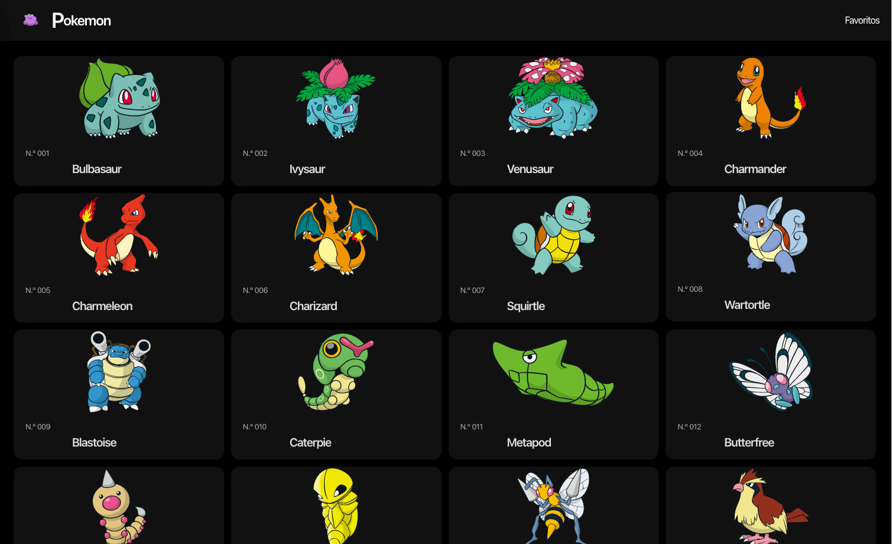

# Static Pokemon App

This article aims to sum up my learning from developing and deploying an static Next.js application. The idea of the application is to list 151 pokemons statically (in build-time) which means rapid interaction between pages (screens) that leads to better user experience.



## Prerequisites

To run the project you will need npm in its latest version.

- [Install NPM](https://nodejs.org/en/download/package-manager/) Package manager for the JavaScript

## What have I learned

- [Next.js](https://nextjs.org/) – The React Framework.
- [NextUI](https://nextui.org/) – Beautiful, fast and modern React UI library.
- [Vercel](https://vercel.com/) – Cloud platform that enables developers to host websites and web services that deploy instantly, scale automatically, and require no supervision.
- [Axios](https://axios-http.com/) – a promise based HTTP client for NodeJS.

## Folder structure

```shell
st-pokemon-sample
.
├── public
│   ├── img
│   │   └── banner.png
│   ├── favicon.ico
│   └── vercel.svg
├── components
│   ├── layouts
│   │   ├── index.ts
│   │   ├── Header.tsx
│   │   └── Layout.tsx
│   ├── pokemon
│   │   ├── FavoritePokemonCard.tsx
│   │   ├── FavoritePokemonList.tsx
│   │   ├── index.ts
│   │   ├── PokemonCard.tsx
│   │   └── PokemonList.tsx
│   └── ui
│       ├── index.ts
│       └── NoFavorites.tsx
├── helpers
│   └── format.helper.ts
├── next.config.js
├── package.json
├── pages
│   ├── pokemon
│   │   ├── name
│   │   │   └── [name].tsx
│   │   └── [id].tsx
│   ├── _app.tsx
│   ├── _document.tsx
│    ├── favorites.tsx
│    └── index.tsx
└── README.md

```
